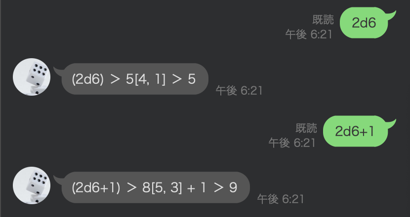

# dice_bot_line
 
TRPGなどに欠かせないダイスロールをLINEボットで実装しました。   


 
## Demo
 

 
## Requirement

* python 3.8.5
 
## Installation
 
```bash
# Clone
git clone https://github.com/Futaba-Kosuke/dice_bot_line
cd dice_bot_line

# (optional) Build the virtual environment
python -m venv .env
source .env/bin/activate

# Install modules
python -m pip install -r requirements.txt
```
 
## Usage
 
```bash
# Start the server
python server.py
```
